# Potyczki Młodych Adminów: Final 2026
## Zespól 9

## Część 1: Pierwsze kroki w Krzak-Polu

### Misja 1:

Został utworzony nowy namespace `krzak-pol-web`

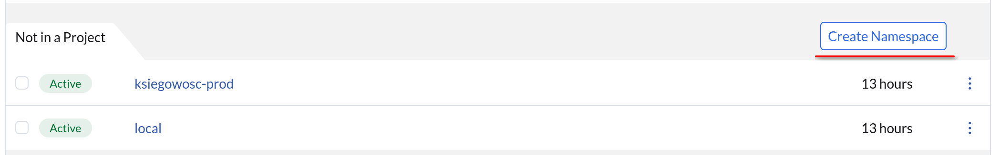

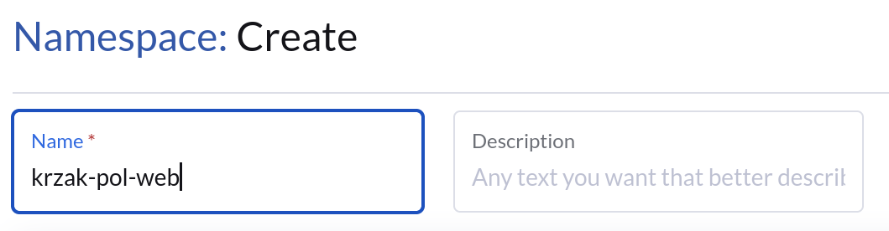

Oraz deployment z obrazem `nginx:alpine` i dwoma replikami z labelem "app": "krzak-nginx"

todo fix nagranie to image


Stworzony został serwis dla klastra


Stworzony został ingress


http://krzakpol.193.187.69.224.nip.io/

### Misja 2:

1. Zainstalowałem charta longhorna z defaultowymi ustawieniami.
2. Namespace `krzak-pol-magazyn` nie istniał, więc go stworzyłem. Potem dodałem pv i pvc:


3. oraz w końcu dodałem deployment:

```yaml
apiVersion: apps/v1
kind: Deployment
metadata:
  annotations:
    deployment.kubernetes.io/revision: '1'
  creationTimestamp: '2026-04-10T09:11:36Z'
  generation: 1
  labels:
    workload.user.cattle.io/workloadselector: apps.deployment-krzak-pol-web-dep-dane-prezesa
  managedFields:
    - apiVersion: apps/v1
      fieldsType: FieldsV1
      fieldsV1:
        f:metadata:
          f:labels:
            .: {}
            f:workload.user.cattle.io/workloadselector: {}
        f:spec:
          f:progressDeadlineSeconds: {}
          f:replicas: {}
          f:revisionHistoryLimit: {}
          f:selector: {}
          f:strategy:
            f:rollingUpdate:
              .: {}
              f:maxSurge: {}
              f:maxUnavailable: {}
            f:type: {}
          f:template:
            f:metadata:
              f:labels:
                .: {}
                f:workload.user.cattle.io/workloadselector: {}
              f:namespace: {}
            f:spec:
              f:affinity: {}
              f:containers:
                k:{"name":"container-0"}:
                  .: {}
                  f:args: {}
                  f:command: {}
                  f:image: {}
                  f:imagePullPolicy: {}
                  f:name: {}
                  f:resources: {}
                  f:securityContext:
                    .: {}
                    f:allowPrivilegeEscalation: {}
                    f:privileged: {}
                    f:readOnlyRootFilesystem: {}
                    f:runAsNonRoot: {}
                  f:terminationMessagePath: {}
                  f:terminationMessagePolicy: {}
                  f:volumeMounts:
                    .: {}
                    k:{"mountPath":"/dane_prezesa"}:
                      .: {}
                      f:mountPath: {}
                      f:name: {}
                  f:workingDir: {}
              f:dnsPolicy: {}
              f:restartPolicy: {}
              f:schedulerName: {}
              f:securityContext: {}
              f:terminationGracePeriodSeconds: {}
              f:volumes:
                .: {}
                k:{"name":"vol-auexa"}:
                  .: {}
                  f:name: {}
                  f:persistentVolumeClaim:
                    .: {}
                    f:claimName: {}
      manager: agent
      operation: Update
      time: '2026-04-10T09:11:36Z'
    - apiVersion: apps/v1
      fieldsType: FieldsV1
      fieldsV1:
        f:metadata:
          f:annotations:
            .: {}
            f:deployment.kubernetes.io/revision: {}
        f:status:
          f:conditions:
            .: {}
            k:{"type":"Available"}:
              .: {}
              f:lastTransitionTime: {}
              f:lastUpdateTime: {}
              f:message: {}
              f:reason: {}
              f:status: {}
              f:type: {}
            k:{"type":"Progressing"}:
              .: {}
              f:lastTransitionTime: {}
              f:lastUpdateTime: {}
              f:message: {}
              f:reason: {}
              f:status: {}
              f:type: {}
          f:observedGeneration: {}
          f:replicas: {}
          f:unavailableReplicas: {}
          f:updatedReplicas: {}
      manager: k3s
      operation: Update
      subresource: status
      time: '2026-04-10T09:11:36Z'
  name: dep-dane-prezesa
  namespace: krzak-pol-web
  resourceVersion: '205982'
  uid: 76be771b-d755-4941-9f30-9bafbeabb8fe
spec:
  progressDeadlineSeconds: 600
  replicas: 1
  revisionHistoryLimit: 10
  selector:
    matchLabels:
      workload.user.cattle.io/workloadselector: apps.deployment-krzak-pol-web-dep-dane-prezesa
  strategy:
    rollingUpdate:
      maxSurge: 25%
      maxUnavailable: 25%
    type: RollingUpdate
  template:
    metadata:
      labels:
        workload.user.cattle.io/workloadselector: apps.deployment-krzak-pol-web-dep-dane-prezesa
      namespace: krzak-pol-web
    spec:
      affinity: {}
      containers:
        - args:
            - '-c'
            - 'sleep'
            - '2147483647'
          command:
            - /bin/sh
          image: busybox:latest
          imagePullPolicy: Always
          name: container-0
          resources: {}
          securityContext:
            allowPrivilegeEscalation: false
            privileged: false
            readOnlyRootFilesystem: false
            runAsNonRoot: false
          terminationMessagePath: /dev/termination-log
          terminationMessagePolicy: File
          volumeMounts:
            - mountPath: /dane_prezesa
              name: vol-auexa
          workingDir: /
      dnsPolicy: ClusterFirst
      restartPolicy: Always
      schedulerName: default-scheduler
      securityContext: {}
      terminationGracePeriodSeconds: 30
      volumes:
        - name: vol-auexa
          persistentVolumeClaim:
            claimName: pvc-dane-prezesa
status:
  conditions:
    - lastTransitionTime: '2026-04-10T09:11:36Z'
      lastUpdateTime: '2026-04-10T09:11:36Z'
      message: Deployment does not have minimum availability.
      reason: MinimumReplicasUnavailable
      status: 'False'
      type: Available
    - lastTransitionTime: '2026-04-10T09:11:36Z'
      lastUpdateTime: '2026-04-10T09:11:36Z'
      message: ReplicaSet "dep-dane-prezesa-5974598cd6" is progressing.
      reason: ReplicaSetUpdated
      status: 'True'
      type: Progressing
  observedGeneration: 1
  replicas: 1
  unavailableReplicas: 1
  updatedReplicas: 1
```

### Misja 3:
Pierwszy błąd to zła nazwa zdjęcia kontenera (httpd a nie httpdd)


Zły label (ksiegowosc-app a nie ksiegowosc-backend)


Port ustawiony na 80 (czyli na ten na który httpd słucha)


### Misja 4:

Dodałem 2 grupy w nv:
 - `krzak-pol-web` - `namespace=krzak-pol-web`
 - `ksiegowosc-prod` - `namespace=ksiegowosc-prod`

i finalnie dodałem i zapplyowałem network rule'a:


### Misja 5:

Liczba replik krzak-pol-web (nginx) została zwiększona do 5


Ustawiono zasoby na 128 Mi RAMu oraz 150mCPU
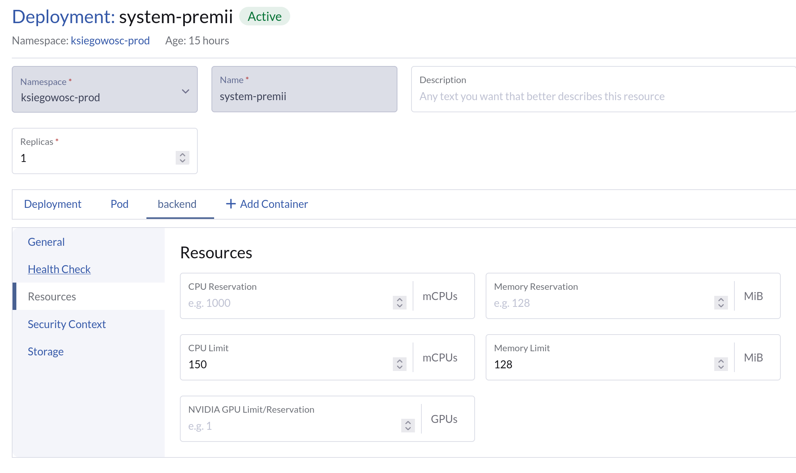


## Część 2: Prezes wchodzi na wyższe obroty

### Misja 6:

1-2: oto nowy deployment z legendarną wizytówką:

```yaml
apiVersion: apps/v1
kind: Deployment
metadata:
  name: nginx
  annotations:
    deployment.kubernetes.io/revision: '8'
    #  key: string
  creationTimestamp: '2026-04-10T08:49:12Z'
  generation: 9
  labels:
    workload.user.cattle.io/workloadselector: apps.deployment-krzak-pol-web-nginx
    #  key: string
  namespace: krzak-pol-web
  resourceVersion: '225185'
  uid: c3c15b40-a8fa-43cd-b2fd-902bbc63f659
  fields:
    - nginx
    - 5/5
    - 5
    - 5
    - 109m
    - container-0
    - nginx:alpine
    - workload.user.cattle.io/workloadselector=apps.deployment-krzak-pol-web-nginx
spec:
  selector:
    matchLabels:
      workload.user.cattle.io/workloadselector: apps.deployment-krzak-pol-web-nginx
      #  key: string
#    matchExpressions:
#      - key: string
#        operator: string
#        values:
#          - string
  template:
    metadata:
      labels:
        app: krzak-nginx
        workload.user.cattle.io/workloadselector: apps.deployment-krzak-pol-web-nginx
        #  key: string
      annotations:
        cattle.io/timestamp: '2026-04-10T10:35:41Z'
        #  key: string
      namespace: krzak-pol-web
    spec:
      containers:
        - image: nginx:alpine
          imagePullPolicy: Always
          name: container-0
          securityContext:
            allowPrivilegeEscalation: false
            privileged: false
            readOnlyRootFilesystem: false
            runAsNonRoot: false
          terminationMessagePath: /dev/termination-log
          terminationMessagePolicy: File
          volumeMounts:
            - mountPath: /usr/share/nginx/html
              name: vol-5aayo
          _init: false
          __active: true
          resources: {}
      dnsPolicy: ClusterFirst
      imagePullSecrets:
#        - name: string
      initContainers:
        - args:
            - '-L'
            - >-
              https://raw.githubusercontent.com/atvalerie/zespol9-potyczki2026/refs/heads/main/assets/index.html
            - '-o'
            - /dupa/index.html
          image: alpine/curl:8.17.0
          imagePullPolicy: Always
          name: container-1
          securityContext:
            allowPrivilegeEscalation: false
            privileged: false
            readOnlyRootFilesystem: false
            runAsNonRoot: false
          terminationMessagePath: /dev/termination-log
          terminationMessagePolicy: File
          volumeMounts:
            - mountPath: /dupa
              name: vol-5aayo
          _init: true
          resources: {}
      restartPolicy: Always
      schedulerName: default-scheduler
      serviceAccount: default
      serviceAccountName: default
      terminationGracePeriodSeconds: 30
      volumes:
        - emptyDir:
            sizeLimit: 100Mi
          name: vol-5aayo
  progressDeadlineSeconds: 600
  replicas: 5
  revisionHistoryLimit: 10
  strategy:
    rollingUpdate:
      maxSurge: 25%
      maxUnavailable: 25%
    type: RollingUpdate
#  minReadySeconds: int
#  paused: boolean
_id: krzak-pol-web/nginx
__clone: true
```

3. Wygenerowałem certyfikat lokalnie openssl i wstawiłem jako `krzakweb-tls`:


następnie dodałem go do ingressu na hosta `krzakpol.193.187.69.224.nip.io`.

Teraz to dopiero czerwono będzie xd


### Misja 7:

Utworzona klasa o nazwie `krzak-longhorn-retain` z polityką `Retain`
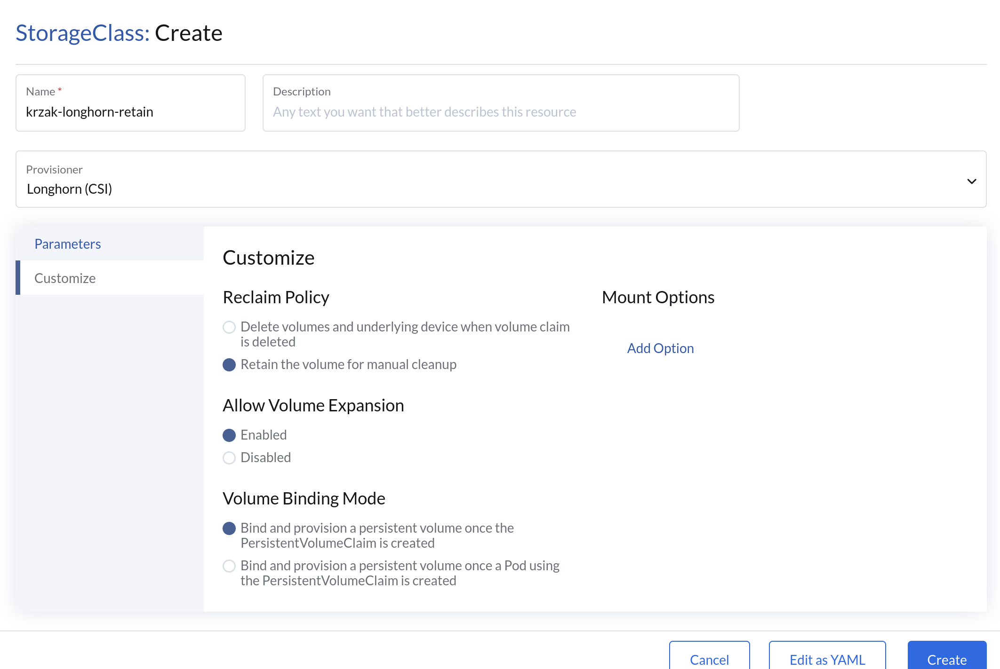

Utworzony namespace `klienci-premium`
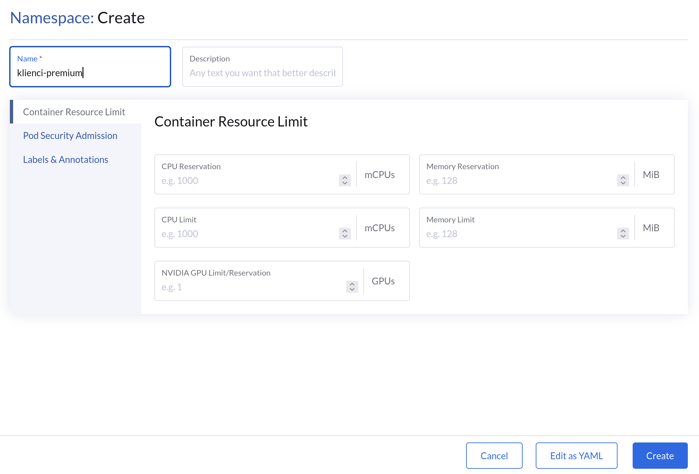

Utworzony serwis headless dla mariiDB
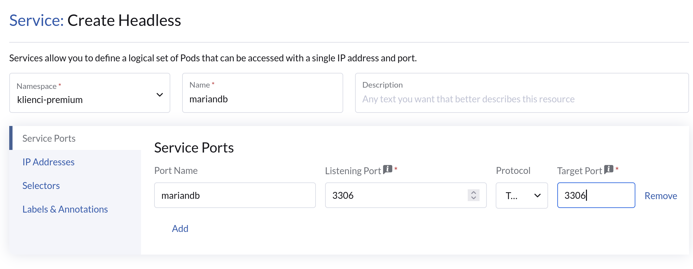

StatefulSet - kontener
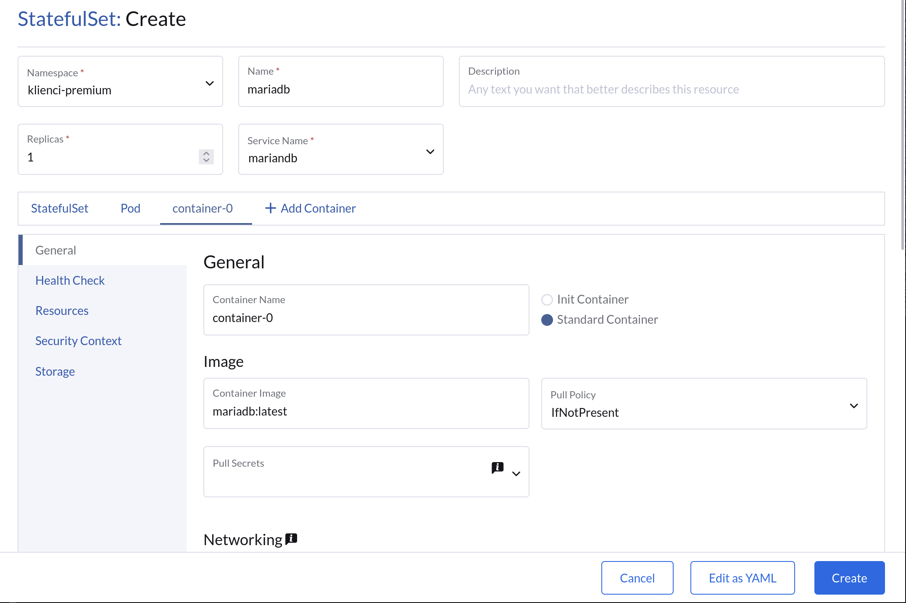

Wolumin
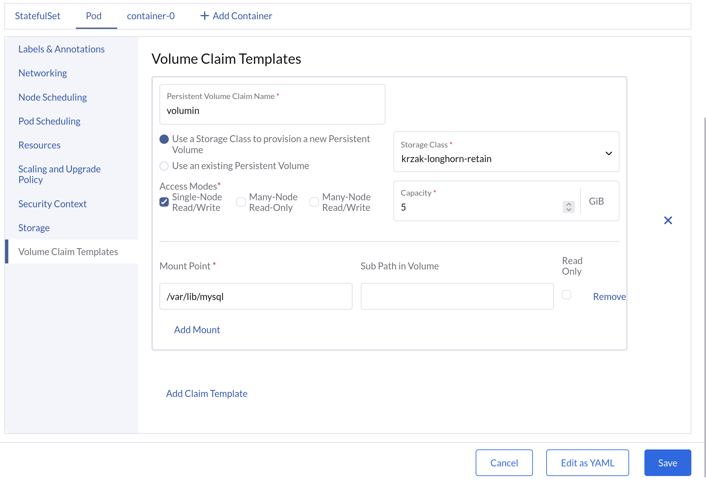

Dodatkowo na końcu zmieniłem wersję MariaDB na noble.

### Misja 8:

Zrobiłem nowy namespace taki jak w configu, zaimportowałem go i ogarnąłem RBAC. Wszystkie zmiany w [diffie](https://github.com/atvalerie/zespol9-potyczki2026/commit/bd54f0fcd1c9716e28ab600ac68f59d15a515940) pliku pendrive są.

### Misja 9:

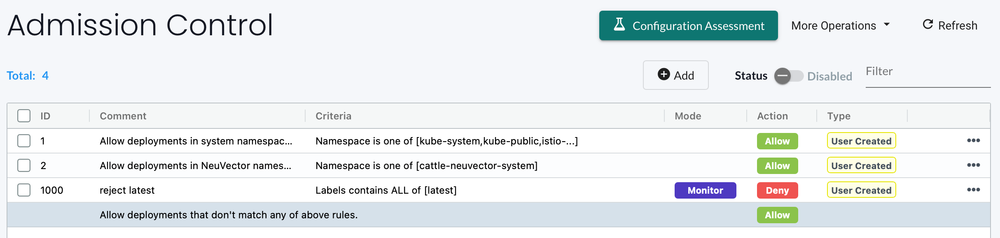

Zrobiłem policy `allowonly-krzak-pol-web`:

```yaml
apiVersion: networking.k8s.io/v1
kind: NetworkPolicy
metadata:
  creationTimestamp: '2026-04-10T11:11:40Z'
  generation: 1
  managedFields:
    - apiVersion: networking.k8s.io/v1
      fieldsType: FieldsV1
      fieldsV1:
        f:spec:
          f:ingress: {}
          f:policyTypes: {}
      manager: agent
      operation: Update
      time: '2026-04-10T11:11:40Z'
  name: allowonly-krzak-pol-web
  namespace: krzak-pol-web
  resourceVersion: '234985'
  uid: 98257735-b218-4ae2-b4e0-d72bfd0e7cdc
spec:
  ingress:
    - from:
        - namespaceSelector:
            matchExpressions:
              - key: kubernetes.io/metadata.name
                operator: In
                values:
                  - krzak-pol-web
            matchLabels:
              kubernetes.io/metadata.name: krzak-pol-web
  podSelector: {}
  policyTypes:
    - Ingress
```

### Misja 10:

Node został ustawiony jako zloto
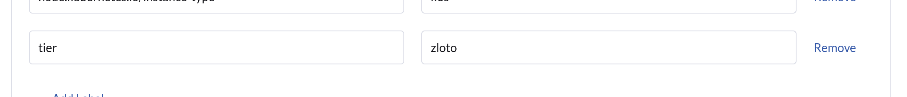

Node affinity ustawione
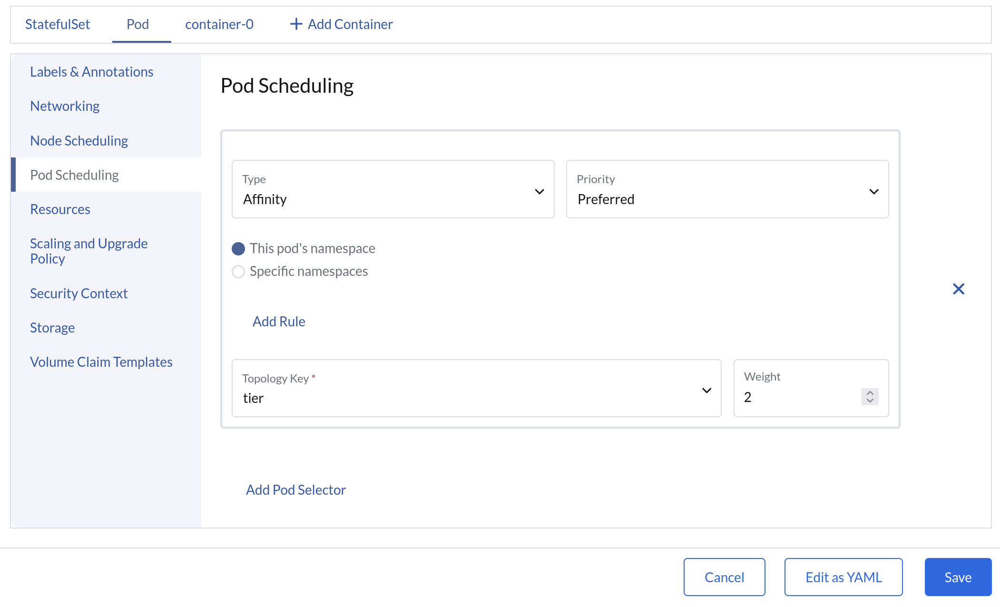

PDB

Dodano app=nginx jako label do deploymenta nginxowskiego.

